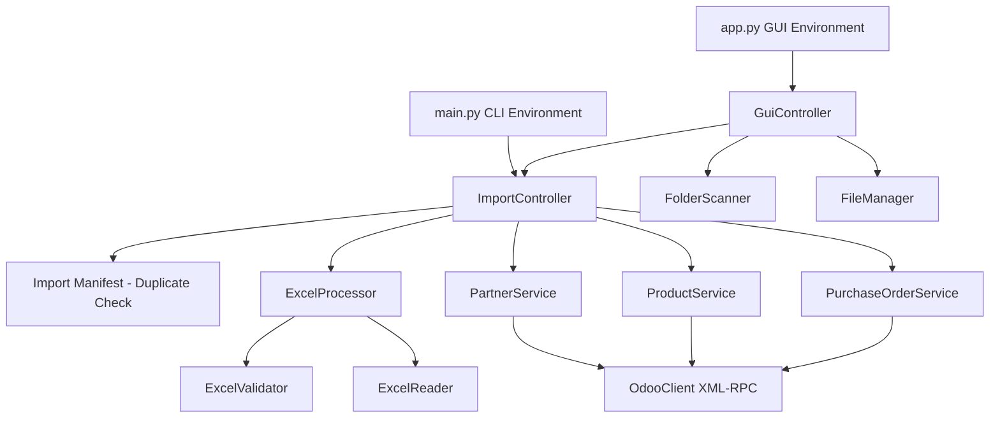

# System Architecture Documentation

This outlines the high-level operational flow mapping user intent into Odoo configurations.

## Module Flow
1. **FolderScanner**: Reads OS directories providing available filenames to the controller.
2. **ImportController**: Top-level coordinator. Instructs Excel mechanics to validate structure, transforms dictionaries, calls Odoo micro-services to look up related foreign keys natively.
3. **FileManager**: Migrates temporary bytes seamlessly to `Processed Orders`.
4. **OdooClient**: Executes `ServerProxy` commands securely over HTTPS.
5. **Excel Pipeline**: A `try...finally` bounded process. The `Processor` manipulates mapping variables natively fetched from the raw rows compiled by the `Reader`, gated firmly by structural mandates parsed through the `Validator`.
